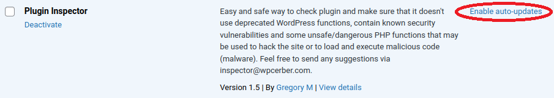
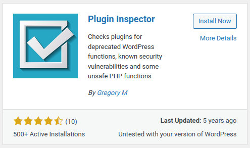
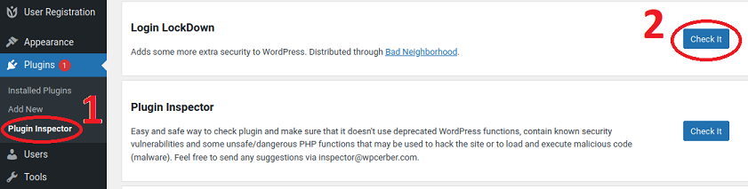
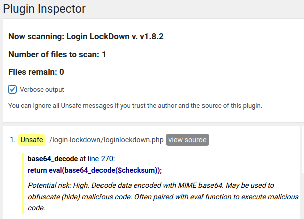

# WordPress Plugins Hardening

WordPress plugins zijn kleine stukjes software die de functionaliteit van je WordPress site verder uitbreiden. Omdat elke WordPress gebruiker andere behoeftes en wensen heeft, zijn deze functionaliteiten niet in de kern van WordPress inbegrepen.

# Wat is een WordPress plugin nu eigenlijk?

Een Plugin is een op zichzelf staand programma, code of script dat je kunt toevoegen aan de blog of website. Plugins worden over het algemeen gemaakt om de standaard functionaliteiten van de website uit te breiden. Plugins kunnen door iedereen gemaakt worden en zijn beschikbaar via de ‘Plugins’ module in het navigatiemenu, er zijn tienduizenden plugins te downloaden en daardoor is er voor elke wens wel een oplossing.

In [deze handleiding](https://www.wphandleiding.nl/wordpress-kennisbank/wordpress-plugins/wat-een-wordpress-plugin/) worden WordPress Plugins uitgebreid beschreven.

# Security Checklist

In de bovenstaande handleiding wordt ook uitgebreid beschreven waar men op moet letten bij het uitzoeken van een WordPress plugin maar verder wordt niet dieper ingegaan op security hardening rondom plugins. Voor security hardening kan de volgende checklist worden gebruikt:

* Hou de plugins up-to-date met de laatste versie
* Deactiveer en verwijder niet gebruikte plugins
* Download en gebruik alleen plugins van betrouwbare bronnen
* Vervang verouderde plugins door nieuwere alternatieve plugins
* Selecteer kritisch een plugin voordat talloze andere plugins worden geïnstalleerd
* Kontroleer de bronkode op kwetsbaarheden

# Automatische Updates

Om een WordPress site veilig te houden, moeten plugins (en themes) altijd worden bijgewerkt naar de nieuwste versie.

Wanneer er een nieuwe versie van een plugin (of theme) beschikbaar is, wordt er een waarschuwingsballon weergegeven in het WordPress beheerdersmenu en wordt de bijbehorende plugin gemarkeerd op het plugins scherm.

Het bijwerken naar de laatste versie kan ook worden geautomatiseerd. Klik daarvoor de Enable auto-updates link bij geïnstalleerde plugins:

Klik [hier](https://wordpress.org/support/article/plugins-themes-auto-updates/) voor meer informatie over automatische updates van plugins (en themes).

# Valideren Bronkode

De bron van inbreuk op de security via plugins is de PHP bronkode. De bronkode van plugins met veel functionaliteit kan bestaan uit vele modules en vele duizenden regels kode. Buiten technische kennis die nodig is om bronkode te inspecteren is het ook een langdurig proces. Daarnaast zal altijd worden geprobeerd om kwetsbaarheden in kode niet op te laten vallen.

Hieronder worden twee oplossingsrichtingen beschreven die kunnen worden gebruikt voor een automatische kontrole van bronkode; een die nog enige handmatig bediening nodig heeft en een die volledig kan worden geïntegreerd in het software ontwikkelings proces.

## Handmatige kontrole met een hulpmiddel

Deze oplossingsrichting is een handmatige bediening met een plugin als hulpmiddel. Een voorbeeld hiervan is de _Plugin Inspector_. Zoek in de WordPress Plugin Directory naar deze plugin en installeer deze als gebruikelijk.

  
Hiermee gaat de bronkode van de Login LockDown plugin worden gevalideerd.

Bij de plugins aan linkerzijde van de admin pagina, klik op de Plugin Inspector link (1) en klik daarna op de Check It knop (2):
  

  
Met dit als resultaat:
  

  
En dit is inderdaad onderdeel van de kode die ervoor zorgt dat gebruikersnamen en wachtwoorden worden verstuurd naar de www.bad-neighborhood.com website simulator.

Probeer nu zelf de PHP kode te achterhalen die een POST request uitvoert naar de webserver.

## Integratie in het software ontwikkelingsproces

Deze oplossingsrichting kan volledig worden geïntegreerd in het software ontwikkelings proces, bijvoorbeeld door opname in een CI/CD pipeline. Het resultaat kan zijn dat een build wordt afgebroken indien verdachte PHP kode wordt gevonden.

Als voorbeeld wordt WPSploit gebruikt. Dit is een Python applicatie en kan worden gedownload van GitHub.

Indien Python nog niet is geïnstalleerd, installeer deze dan met:

    sudo apt install python

Kontroleer of de installatie is gelukt met:

    python --version

Indien Git nog niet is geïnstalleerd, installeer deze dan met:

    sudo apt install git

Kontroleer of de installatie is gelukt met:

    git --version

Kloon de repository van GitHub in de home folder met:

    cd ~
    git clone https://github.com/b4dnewz/wpsploit

Maak nu een link naar de Python applicatie zodat deze vanuit een wilekeurige folder kan worden gestart:

    cd wpsploit
    sudo ln -s $PWD/wpsploit.py /usr/local/bin/wpsploit

De kwetsbaarheden waarop wordt getest is [deze lijst](https://github.com/wpscanteam/wpscan/wiki/WordPress-Plugin-Security-Testing-Cheat-Sheet) die tevens wordt gebruikt door het WPScan Team.

Nu gaat de bronkode van de Login LockDown plugin worden gevalideerd.

Ga hiervoor naar de plugin folder:

    cd /srv/www/wordpress/wp-content/plugins/login-lockdown

En start de applicatie met:

    sudo wpsploit ./loginlockdown.php

Met als resultaat deze uitvoer:

    [L277] Possibile Cross-Site Scripting ==> $_POST['update_loginlockdownSettings']
    [L282] Possibile Cross-Site Scripting ==> $_POST['ll_max_login_retries']
    [L283] Possibile Cross-Site Scripting ==> $_POST['ll_max_login_retries']
    [L285] Possibile Cross-Site Scripting ==> $_POST['ll_retries_within']
    [L286] Possibile Cross-Site Scripting ==> $_POST['ll_retries_within']
    [L288] Possibile Cross-Site Scripting ==> $_POST['ll_lockout_length']
    [L289] Possibile Cross-Site Scripting ==> $_POST['ll_lockout_length']
    [L291] Possibile Cross-Site Scripting ==> $_POST['ll_lockout_invalid_usernames']
    [L292] Possibile Cross-Site Scripting ==> $_POST['ll_lockout_invalid_usernames']
    [L294] Possibile Cross-Site Scripting ==> $_POST['ll_mask_login_errors']
    [L295] Possibile Cross-Site Scripting ==> $_POST['ll_mask_login_errors']
    [L297] Possibile Cross-Site Scripting ==> $_POST['ll_show_credit_link']
    [L298] Possibile Cross-Site Scripting ==> $_POST['ll_show_credit_link']
    [L305] Possibile Cross-Site Scripting ==> $_POST['release_lockdowns']
    [L310] Possibile Cross-Site Scripting ==> $_POST['releaseme']
    [L311] Possibile Cross-Site Scripting ==> $_POST['releaseme']
    [L149] Possibile Cross-Site Scripting ==> $_SERVER['REMOTE_ADDR']
    [L165] Possibile Cross-Site Scripting ==> $_SERVER['REMOTE_ADDR']
    [L186] Possibile Cross-Site Scripting ==> $_SERVER['REMOTE_ADDR']
    [L207] Possibile Cross-Site Scripting ==> $_SERVER['REMOTE_ADDR']
    [L339] Possibile Cross-Site Scripting ==> $_SERVER["REQUEST_URI"]
    [L371] Possibile Cross-Site Scripting ==> $_SERVER["REQUEST_URI"]
    [L412] Possibile Cross-Site Scripting ==> $_SERVER["HTTP_HOST"]
    [L416] Possibile Cross-Site Scripting ==> $_SERVER["REQUEST_URI"]
    [L178] Possibile Sql Injection ==> $wpdb->query($insert)
    [L200] Possibile Sql Injection ==> $wpdb->query($insert)
    [L316] Possibile Sql Injection ==> $wpdb->query($releasequery)
    [L157] Possibile Sql Injection ==> $wpdb->get_var($numFailsquery)
    [L214] Possibile Sql Injection ==> $wpdb->get_var($stillLockedquery)
    [L269] Possibile PHP Code Execution ==> eval(base64_decode($checksum))
    [L263] Possibile PHP Code Execution ==> preg_replace("/([A-f0-9]{4})
    [L342] Possibile Cross-Site Request Forgery ==> wp_nonce_field('login-lockdown_update-options')
    [L374] Possibile Cross-Site Request Forgery ==> wp_nonce_field('login-lockdown_release-lockdowns')
    [L280] Possibile Cross-Site Request Forgery ==> check_admin_referer('login-lockdown_update-options')
    [L308] Possibile Cross-Site Request Forgery ==> check_admin_referer('login-lockdown_release-lockdowns')
    Found 35 possible vulnerabilities in 1 files

Net als de Plugin Inspector plugin wordt de verdachte regel kode gevonden:

    [L269] Possibile PHP Code Execution ==> eval(base64_decode($checksum))

