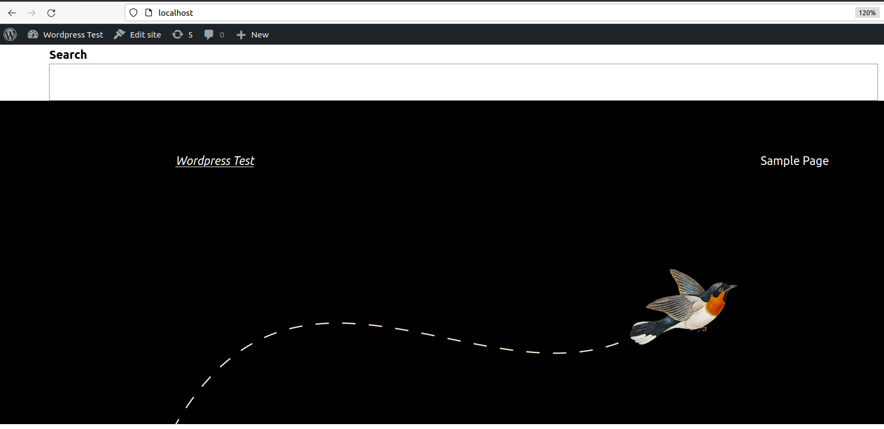
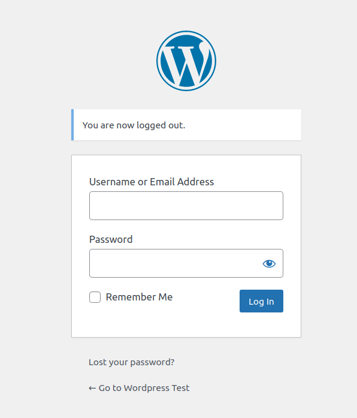

# README #

In deze README worden de stappen uitgelegd om Wordpress op Ubuntu OS, phpmyadmin, de legitieme en de minder legitieme plugin te installeren.

Deze README gaat niet in hoe Ubuntu te installeren. Het is raadzaam om de OS te installeren op een VM (Virtual Machine).
Zorg ervoor dat je voldoende ruimte hebt op je virtual machine of host zodat je alles kunt downloaden. Voor Wordpress heb je ongeveer 30 á 35 MB nodig.

**Belangrijk**

Clone eerst de repoistory naar een folder/directory op je computer, dit doe je met het volgende commando:

`git clone https://bitbucket.org/saltcybersecurity/wordpress-plugin/src/master/`

Veel plezier met het lezen en uitvoeren van de stappen!

## Inhoudsopgave ##

* Installatie Wordpress
    * installeer dependencies
    * installeer Wordpress
    * configureer Apache
    * configureer database
    * configureer Wordpress met database
    * configureer Wordpress
* Installatie Phpmyadmin
* Installatie Login LockDown plugin
* Installatie Website Simulator
* Installatie Laatste Versie Login LockDown plugin

# Installatie Wordpress #

## installeer dependencies ##

Om Apache en PHP te installeren gebruiken we de volgende commando's in de terminal:

`sudo apt update`

    sudo apt install apache2 \
                 ghostscript \
                 libapache2-mod-php \
                 mysql-server \
                 php \
                 php-bcmath \
                 php-curl \
                 php-imagick \
                 php-intl \
                 php-json \
                 php-mbstring \
                 php-mysql \
                 php-xml \
                 php-zip

Daarnaast is het van belang om het curl commando te installeren. Dat doe je met het volgende commando:

`sudo apt install curl`

## installeer Wordpress ##

 Om Wordpress te installeren gebruiken we de volgende commando's:

`sudo mkdir -p /srv/www`

`sudo chown www-data: /srv/www`

`curl https://wordpress.org/latest.tar.gz | sudo -u www-data tar zx -C /srv/www`

## Apache ##

**Let op** deze stap is alleen als je al een Apache server op je computer hebt geconfigureerd!

Stap 0
Het kan noodzakelijk zijn om de service te starten. Dit doe je door:

`sudo service apache2 start`

Daarna ga je door met de volgende stappen.

Maak een Apache site aan. Maak een folder in 
`/etc/apache2/sites-available/wordpress.conf`.

Om een bestand aan te maken gebruiken we het commando 'touch'.
Het commando daarvoor is als volgt:

`touch /etc/apache2/sites-available/wordpress.conf`

Nu is er een bestand aangemaakt genaamd 'wordpress.conf' in de directory */etc/apache2/sites-available* 
Daarna moeten we het bestand aanpassen/invullen. Dit doe je door bijvoorbeeld een tekst-editor te gebruiken als nano of vim. In ons geval maken we gebruik van nano

Zet in het *wordpress.conf* bestand de volgende code:

    <VirtualHost *:80>

        DocumentRoot /srv/www/wordpress

        <Directory /srv/www/wordpress>

            Options FollowSymLinks

            AllowOverride Limit Options FileInfo

            DirectoryIndex index.php

            Require all granted

        </Directory>

        <Directory /srv/www/wordpress/wp-content>

            Options FollowSymLinks

            Require all granted

        </Directory>

    </VirtualHost>

Bij deze stap wordt er een webserver aangemaakt op poort 80.

Daarna moet de site 'aangezet' worden met het volgende commando:

`sudo a2ensite wordpress`

Toestaan van URL herschrijven:

`sudo a2enmod rewrite`

Zet de default "It Works" site uit:

`sudo a2dissite 000-default`

Start daarna de Apache service opnieuw op:

`sudo service apache2 reload`
## Database ##

**Let op** deze stap is alleen als je al een MySQL database op je computer hebt geconfigureerd!

Stap 0
Het kan noodzakelijk zijn om de MySQL service opnieuw te starten, dit doe je door:

`sudo service mysql start`

Ga daarna door met de volgende stappen.
 
 

We maken een MySQL database met de volgende commando's:

Stap 1

`sudo mysql -u root`

Stap 2 (dit zijn de commando's in mysql)

`CREATE DATABASE wordpress;`

`CREATE USER wordpress@localhost IDENTIFIED BY 'voeg hier je wachtwoord in';`

    GRANT SELECT, INSERT,UPDATE,DELETE,CREATE,DROP,ALTER ON wordpress.* TO wordpress@localhost;

`FLUSH PRIVILEGES;`

`quit`

Daarna start je de mysql service:

`sudo service mysql start`
## Wordpress met database ##

In deze stap gaan we Wordpress met de database koppelen.

Allereerst kopieer het 'sample' bestand naar `wp-config-php`.

Dit doen we door het volgende commando te gebruiken:

`sudo -u www-data cp /srv/www/wordpress/wp-config-sample.php /srv/www/wordpress/wp-config.php`

In de volgende stap worden de credentials aangemaakt. **Let op** verander de volgende gedeeltes niet in het commando `database_name_here` en `username_here`.

Je vervangt wel `your password` met je database wachtwoord!

    sudo -u www-data sed -i 's/database_name_here/wordpress/' /srv/www/wordpress/wp-config.php
    sudo -u www-data sed -i 's/username_here/wordpress/' /srv/www/wordpress/wp-config.php
    sudo -u www-data sed -i 's/password_here/<your-password>/' /srv/www/wordpress/wp-config.php

Open daarna de configuration file in nano (of welke tekst-editor je gebruikt):

`sudo -u www-data nano /srv/www/wordpress/wp-config.php`

Zoek naar de volgende tekst:

    define( 'AUTH_KEY',         'put your unique phrase here' );
    define( 'SECURE_AUTH_KEY',  'put your unique phrase here' );
    define( 'LOGGED_IN_KEY',    'put your unique phrase here' );
    define( 'NONCE_KEY',        'put your unique phrase here' );
    define( 'AUTH_SALT',        'put your unique phrase here' );
    define( 'SECURE_AUTH_SALT', 'put your unique phrase here' );
    define( 'LOGGED_IN_SALT',   'put your unique phrase here' );
    define( 'NONCE_SALT',       'put your unique phrase here' );

Verwijder deze tekst en vervang met de tekst van onderstaande link
 
 
Dit is de <a href="https://api.wordpress.org/secret-key/1.1/salt/">link</a>.
 
 
Sla het bestand op.
## Wordpress configuratie ##

Open nu een browser en ga naar <a href="http://localhost/">http://localhost/</a>.

Volg hier het installatie proces. 

Na het voltooien van het installatie proces kun je opnieuw naar <a href="http://localhost/">http://localhost/</a> gaan.

Als het goed is zie je een pagina zoals onderstaande foto.

Daarna kun je inloggen via <a href="http://localhost/wp-login.php">http://localhost/wp-login.php</a>

Als alles werkt dan zie je deze inlogpagina.

 
 
 
Je Wordpress website is klaar om te gebruiken!

Ga nu verder om phpmyadmin te configureren.

# Installatie phpMyAdmin

phpMyAdmin is een hulpmiddel om de database van WordPress te beheren. Nadat WordPress is geinstalleerd kan phpMyAdmin worden geinstalleerd; voer hiervoor het volgende kommando uit:

    sudo apt install phpmyadmin

En afhankelijk van de onderliggende webserver technologie de volgende kommando's:

Voor een Apache server:

    sudo ln -s /etc/phpmyadmin/apache.conf /etc/apache2/conf-available/phpmyadmin.conf
    sudo a2enconf phpmyadmin.conf
    sudo service apache2 reload

Voor een Nginx server:

    sudo ln -s /user/share/phpmyadmin /var/www/public_html/phpmyadmin
    nginx -s reload

phpMyAdmin draait als web applicatie en wordt gestart in een browser met de volgende URL:

    localhost/phpmyadmin/

Er kan nu worden ingelogd met de gebruiker en wachtwoord zoals opgegeven tijdens de installatie van WordPress. Hierna kan de database behorend bij WordPress worden bekeken en beheerd.

# Installatie Login LockDown plugin

Om wat extra security toe te voegen wordt de Login LockDown gebruikt welke verkeerde inlogpogingen vastlegd in de database. Daarnaast kan het zo worden ingericht dat inlogpogingen helemaal niet meer toegestaan voor een bepaalde tijd.

* Ga naar de admin pagina van WordPress
* Klik op de Plugins link aan de linkerzijde
* Klik op de Add New knop aan de bovenzijde
* Zoek naar de Login LockDown plugin aan de rechterzijde (plugin verschijnt nu bovenaan)
* Klik op de Install Now knop
* Klik op de Activate knop (de plugin staat nu bij de lijst van active plugins)
* Probeer in te loggen met een juiste gebruikersnaam maar een verkeerd wachtwoord (probeer dit maar één keer!)
* Kontroleer in phpMyAdmin of er inderdaad een logging wordt vermeld van het gebruik van een verkeerd wachtwoord (tabel wp_login_fails)

# Installatie www.bad-neighborhood.com Website Simulator

De ontwikkelaar van de Login LockDown plugin heeft een eigen website www.bad-neighborhood.com en om daar geen gebruik van te hoeven maken wordt er gebruik gemaakt van een simulatie die lokaal op de machine draait.

Voer de volgende stappen uit om deze lokaal te installeren.

Maak een subfolder in de Applications subfolder:

    ~$ cd ~/Applications
    ~/Applications$ mkdir www.bad-neighborhood.com

Download de www.bad-neighborhood.com.zip file en pak de zip file uit in de net aangemaakte subfolder. Hierna staan in deze folder in ieder geval twee bestanden:

    index.html
    server.py

Start de simulator met:

    ./server.py

Indien succesvol gestart verschijnt de logging:

    INFO:root:Starting httpd...

De website simulator draait op poort 10000 en dus kan de home page van de website worden bezocht in een browser met de volgende URL:

    localhost:10000

# Installatie Laatste Versie van de Login LockDown plugin

In een van de stappen hiervoor is versie 1.8.1 van de Login LockDown plugin geinstalleerd. Op de website simulator is een nieuwste versie 1.8.2 beschikbaar die geinstalleerd moet worden. Ergens op de pagina staat een link:

    Download: Login LockDown v1.8.2

Klik op deze link en hierna wordt de zip file login-lockdown.1.8.2.zip gedownload en geplaatst in de Downloads folder.

De stappen voor installatie zijn iets anders dan de eerdere installatie van versie 1.8.1:

* Ga naar de admin pagina van WordPress
* Klik op de Plugins link aan de linkerzijde
* Klik op de Add New knop aan de bovenzijde
* Klik op de Upload Plugin knop aan de bovenzijde
* Klik op de Browse... knop
* Selecteer de login-lockdown.1.8.2.zip uit de Downloads folder
* Klik op de Install Now knop
* Klik op de Replace current with uploaded knop

En vervolgens:

1. Kontroleer op de WordPress admin pagina of nu inderdaad versie 1.8.2 actief is.
2. Probeer nu weer eens in te loggen met een onjuist wachtwoord.
3. Log nu weer in met het juiste wachtwoord.
4. Kontroleer in phpMyAdmin of er inderdaad weer een logging wordt vermeld van het gebruik van een verkeerd wachtwoord.

Ga nu terug naar de www.bad-neighborhood.com website simulator in de browser.

Onderaan de pagina staat:

    Read our disclaimer & secrets

Klik op de secrets link en wees verbaasd over wat er nu getoond wordt op het scherm!
